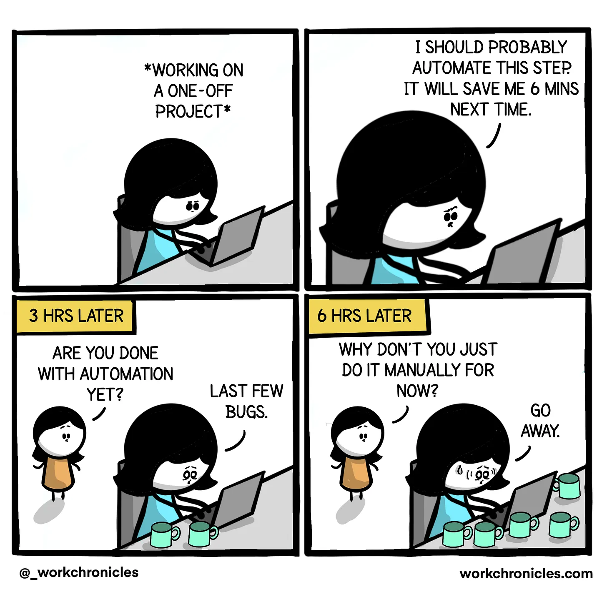
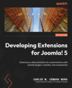
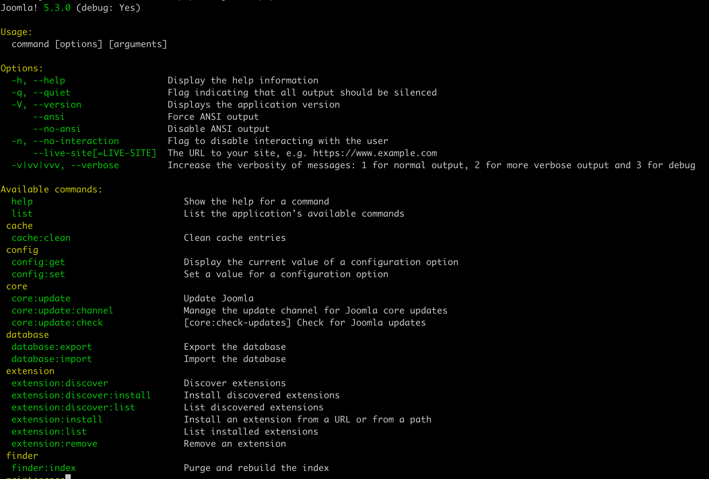

<!--
_header: "Pourquoi je suis ici"
footer: '[Developing Extensions for Joomla! 5](https://developingextensionsforjoomla5.com/jdayfr2025)'
-->

<div class="columns">
<div class="column column__content">

- Auteur de _Developing Extensions for Joomla! 5_
- J'adore la CLI !!
- Quelques projets que j'ai réalisés avec la CLI :
  - Créer des files d'attente d'e-mails
  - Vérifier les abonnements à renouveler
  - Mettre à jour 26000 produits sur un site HikaShop

</div>
<div class="column">


## Carlos Cámara

</div>
</div>

---

<!--
_header: "Le Grand Tour des Aventures d'Aujourd'hui"
footer: '[Developing Extensions for Joomla! 5](https://developingextensionsforjoomla5.com/jdayfr2025)'
-->

1. Pourquoi la CLI ?
2. Travailler avec la console dans Joomla!
3. Écrire notre premier plugin de console dans Joomla!
4. Ajouter des options à notre commande

Vous pouvez télécharger la version la plus récente de cette présentation à l'adresse suivante :

<div class="url container text-center text-white width-90">
  <a href="https://developingextensionsforjoomla5.com/jdayfr2025/">https://developingextensionsforjoomla5.com/jdayfr2025/</a>
</div>

---

<!--
_header: "Pourquoi la CLI ?"
-->

<div class="container text-center">



<div class="url text-center text-white widht-90">
  Source : <a href="https://workchronicles.substack.com/p/comic-automation">https://workchronicles.substack.com/p/comic-automation</a>
</div>
</div>

<!--

1. CLI is a great way to automate CRON jobs
2. No timeout in CLI
3. We may have different PHP configuration settings
4. Geeky way of doing things

-->

---

<!--
_header: "Un peu de console Joomla!"
-->

<div class="columns">
<div class="column column__content">

<div class="terminal">
php cli/joomla.php --list
</div>

<!--
1. Login to ssh or your terminal
2. Go to the Joomla root folder
3. Run the command: `php cli/joomla.php`
4. You will see a list of commands available
-->
</div>
<div class="column column__reference">

### Références


Chapitre 9

</div>

</div>

<!--
- You need ssh or terminal access
- It's implemented with Symfony console
- All options and settings from symfony console are valid
-->

---

<!--
_header: "Un peu de console Joomla!"
-->

<div class="columns">
<div class="column column__content">

<div class="container">



</div>

</div>
<div class="column column__reference">

### Références


Chapitre 9

</div>

</div>
<!--
1. You will see a list of commands available
1. Commands are usually 2 keywords separated by a colon and they are grouped by the first keyword
-->

---

<!--
_header: "Quelques conseils d'utilisation"
-->
<div class="columns">
  <div class="column column__content">

1. Toutes les commandes sont exécutées à l'aide de la commande :

  <div class="terminal container">
  php cli/joomla.php COMMANDE
  </div>

2. Vous pouvez exécuter la commande avec l'option `--help` pour voir les options disponibles

3. La pratique courante consiste à inclure le nom du composant associé dans le nom de la commande

  </div>
  <div class="column column__reference">

### Références


Chapitre 9

  </div>
</div>

<!--
1. You need ssh or terminal access
1.  It's implemented with Symfony console
1. All options and settings from symfony console are valid
-->

---

<!--
_header: "Ajout de commandes CLI à Joomla!"
-->

1. Les commandes principales sont codées en dur dans Joomla!
2. Pour ajouter plus de commandes, nous pouvons développer un plugin `console`

---

<!--
_header: "Tous les plugins sont créés égaux"
-->

<div class="columns">
  <div class="column column__content">

1. Les plugins de console ont la même structure que les autres plugins.
2. Les plugins de console se trouvent dans le dossier `plugins/console`.
3. Pour la sortie, nous devons être conscients que nous n'avons plus affaire à du HTML.

  </div>
  <div class="column column__reference">

### Références


Chapitre 9

  </div>
</div>

---

<!--
_header: "Atelier de l'année dernière"
-->

<div class="columns">
  <div class="column column__content">

1. Composant de liste de tâches à faire ([Téléchargez-le depuis
   GitHub](https://github.com/carcam/webservices-jd24fr/releases/download/v1.1.0/com_aiwfc.zip))
2. Créons un plugin pour vérifier nos souhaits

  </div>
  <div class="column column__reference">

### Références


[Atelier 2024](https://developingextensionsforjoomla5.com/jdayfr2024)

  </div>
</div>

<!--

 - `php joomla.php extension:install --url=https://github.com/carcam/webservices-jd24fr/releases/download/v1.1.0/com_aiwfc.zip`

-->

---

<!--
_header: "Commençons à écrire notre plugin"
-->
<div class="columns">
<div class="column column__content">

Dans votre installation de Joomla!, créez notre arborescence de dossiers :

Créez l'arborescence de dossiers :

1. `plugins/console`
2. `plugins/console/aiwfc/services`
3. `plugins/console/aiwfc/src`
4. `plugins/console/aiwfc/src/Extension`
5. `plugins/console/aiwfc/src/CliCommand`

</div>
<div class="column column__reference">

### Références


Chapitre 9

</div>
</div>

---

<!--
_header: "plugins/console/aiwfc/aiwfc.xml"
-->

<div class="columns">
<div class="column column__content">

```xml
<extension type="plugin" folder="console" method="upgrade">
...
    <namespace path="src">Noel\Plugin\Console\Aiwfc</namespace>
    <files>
        <folder plugin="aiwfc">services</folder>
        <folder>src</folder>
    </files>
</extension>
```

<div class="url text-white container">
  <a href="https://developingextensionsforjoomla5.com/jdayfr2025/live/basic-plugin">https://developingextensionsforjoomla5.com/<br/>
  jdayfr2025/live/basic-plugin</a>
</div>

</div>
<div class="column column__reference">

### Références


Chapitres 8 et 9

</div>
</div>

<!--
-->

---

<!--
_header: "src/CliCommands/ListingCommand.php"
-->

<div class="columns">
<div class="column column__content">

```php
<?php
namespace Noel\Plugin\Console\Aiwfc\CliCommand;

class ListingCommand extends AbstractCommand
{
  protected static $defaultName = 'aiwfc:listing';

  protected function configure(): void
  {
    $this->setDescription('Vérifiez les dates limites de vos tâches.');
    $this->setHelp('Exécutez aiwfc:listing pour vérifier les dates limites de vos tâches.');
  }

  protected function doExecute(InputInterface $input, OutputInterface $output): int{}

}

```

<div class="url text-white container">
  <a href="https://developingextensionsforjoomla5.com/jdayfr2025/live/basic-plugin">https://developingextensionsforjoomla5.com/<br/>
  jdayfr2025/live/basic-plugin</a>
</div>

</div>
<div class="column column__reference">

### Références


Chapitres 8 et 9

</div>
</div>

<!--
-->

---

<!--
_header: "src/Extension/AiwfcConsolePlugin.php"
-->

<div class="columns">
<div class="column column__content">

```php
<?php

namespace Noel\Plugin\Console\Aiwfc\Extension;

use Noel\Plugin\Console\Aiwfc\CliCommand\ListingCommand;

class AiwfcConsolePlugin extends CMSPlugin implements SubscriberInterface
{
    protected $autoloadLanguage = true;

    public static function getSubscribedEvents(): array
    {
        return [
                ApplicationEvents::BEFORE_EXECUTE => 'registerCLICommands'
        ];
    }

    public function registerCLICommands(ApplicationEvent $event): void
    {
        $app = $event->getApplication();

        $app->addCommand(new ListingCommand());
    }
}

```

<div class="url text-white container">
  <a href="https://developingextensionsforjoomla5.com/jdayfr2025/live/basic-plugin">https://developingextensionsforjoomla5.com/<br/>
  jdayfr2025/live/basic-plugin</a>
</div>

</div>
<div class="column column__reference">

### Références


Chapitres 8 et 9

</div>
</div>

<!--
-->

---

<!--
_header: "services/provider.php"
-->

<div class="columns">
<div class="column column__content">

```php
<?php

...
use Noel\Plugin\Console\Aiwfc\Extension\AiwfcConsolePlugin;

return new class implements ServiceProviderInterface
{
    public function register(Container $container)
    {
        $container->set(
            PluginInterface::class,
            function (Container $container) {
                $dispatcher = $container->get(DispatcherInterface::class);
                $plugin = new AiwfcConsolePlugin( $dispatcher,
                    (array) PluginHelper::getPlugin('console', 'aiwfc')
                );

                return $plugin;
            }
        );
    }
};
```

<div class="url text-white container">
  <a href="https://developingextensionsforjoomla5.com/jdayfr2025/live/basic-plugin">https://developingextensionsforjoomla5.com/<br/>
  jdayfr2025/live/basic-plugin</a>
</div>

</div>
<div class="column column__reference">

### Références


Chapitres 8 et 9

</div>
</div>

<!--
-->

---

<!--
_header: "Première installation"
-->

<div class="columns">
<div class="column column__content">

1. Nous utilisons la belle fonction _Découvrir_ dans l'administration de Joomla!
2. Nous activons le plugin dans notre administration
3. Après cela, nous pouvons exécuter la commande:

<div class="terminal">

php cli/joomla.php aiwfc:listing

</div>

</div>
<div class="column column__reference">

### Références


Chapitre 9

</div>
</div>

<!--
-->

---

<!--
_header: "Ajout de fonctionnalités à notre plugin"
-->

File: `src/CliCommand/TaskDeadlineCommand.php`

```php
    class ListingCommand extends AbstractCommand
    {
      ...

      protected function doExecute(InputInterface $input, OutputInterface $output):  int
      {
          $outputStyle = new SymfonyStyle($input, $output);
          $outputStyle->title('Vos souhaits');

          $wishes = $this->getWishes();

          $this->showWishes($outputStyle, $wishes);

          return Command::SUCCESS;
      }

    }

```

</div>
<div class="column column__reference">

### Références


Chapitre 9

</div>
</div>

<!--
-->

---

<!--
_header: "Ajout de fonctionnalités à notre plugin"
-->

<div class="columns">
<div class="column column__content">

Fichier : `src/CliCommand/ListingCommand.php`

```php
      protected function getWishes(): array
      {
        $db = Factory::getContainer()->get(DatabaseInterface::class);
        $query = $db->createQuery();
        $query->select('*')
            ->from('#__aiwfc_souhaits');

        $db->setQuery($query);
        $wishes = $db->loadAssocList('id');

        return $wishes;
      }

      protected function showWishes($outputStyle, $list)
      {
          if (empty($list)) {
              $outputStyle->note('Il n'y a pas de souhaits.');
          } else {
              $outputStyle->table(['Id', 'Souhait', 'État', 'Description', 'Créé en', 'Créé par'], $list);
          }
      }
```

</div>
<div class="column column__reference">

### Références


Chapitre 9

</div>
</div>

<!--
-->

---

<!--
_header: "Ajout d'options à notre commande"
-->
<div class="columns">
<div class="column column__content">

Fichier : `src/CliCommand/ListingCommand.php`

```php
    class ListingCommand extends AbstractCommand
    {
      protected function configure(): void
      {
          ...

          $this->addOptions();
      }

      protected function addOptions()
      {
          $description = 'Cochez uniquement les souhaits datant de ce nombre de jours.';
          $this->addOption('jours', 'j', InputOption::VALUE_OPTIONAL, $description, 7);

          return;
      }
    }
```

</div>
<div class="column column__reference">

### Références


Chapitre 9

</div>
</div>

---

<!--
_header: "Passer les options à notre commande"
-->

```php
      protected function doExecute(InputInterface $input, OutputInterface $output):  int
      {
          $outputStyle = new SymfonyStyle($input, $output);
          $outputStyle->title('Vos souhaits');

          $options = $this->getOptions($input);

          $wishes = $this->getWishes($options);

          $this->showWishes($outputStyle, $wishes);

          return Command::SUCCESS;
      }

      protected function getOptions($input): array
      {
          $options = [];

          $options = $input->getOptions();

          return $options;
      }
```

</div>
<div class="column column__reference">

### Références


Chapitre 9

</div>
</div>

---

<!--
_header: "Passer les options à notre commande"
-->

<div class="columns">
<div class="column column__content">

```php
  ...
    class ListingCommand extends AbstractCommand
    {
      ...

    protected function getWishes($options): array
    {
        $wishes = [];
        $days = (int)$options['jours'];
        if ($days <= 0) {
            $days = 7;
        }

        $db = Factory::getContainer()->get(DatabaseInterface::class);
        $query = $db->createQuery();
        $query->select('*')
            ->from('#__aiwfc_souhaits');
        $query->where('cree_le BETWEEN DATE_SUB(NOW(), INTERVAL ' . $days . ' DAY) AND NOW()');
        $db->setQuery($query);
        $wishes = $db->loadAssocList('id');

        return $wishes;
    }

    }
```

</div>
<div class="column column__reference">

### Références


Chapitre 9

</div>
</div>

---

<!--
_header: "Idées de commandes"
-->
<div class="columns">
<div class="column column__content">

### Vérifications de base pour notre plugin

- Expiration du domaine
- Expiration SSL
- Utilisation du disque
- Article publié cette semaine

</div>
<div class="column column__reference">

### Références


Chapitre 1

</div>
</div>

---

<!--
_header: "Sur les épaules de géants"
-->

- Joomla Extension Development par Nicholas Dionysopoulos
  - https://www.dionysopoulos.me/book.html
- Joomla 4 – Developing Extensions: Step by step to an working Joomla extension

  - https://a.co/d/1BIVa8j
  - https://web.archive.org/web/20230518080457/https://blog.astrid-guenther.de/en/der-weg-zu-joomla4-erweiterungen/

- Documentation Joomla!

  - https://manual.joomla.org

  <!-- I have not seen furhther but I definitely was on the shoulders of giants.-->

---

<!--
_class: thank-you
footer: ''
-->

<div class="text-huge">
    Merci !
</div>

<div>

Obtenez tout le code et plus d'articles sur le développement d'extensions Joomla! sur :
<a href="https://developingextensionsforjoomla5.com">DevelopingExtensionsForJoomla5.com</a>

</div>
