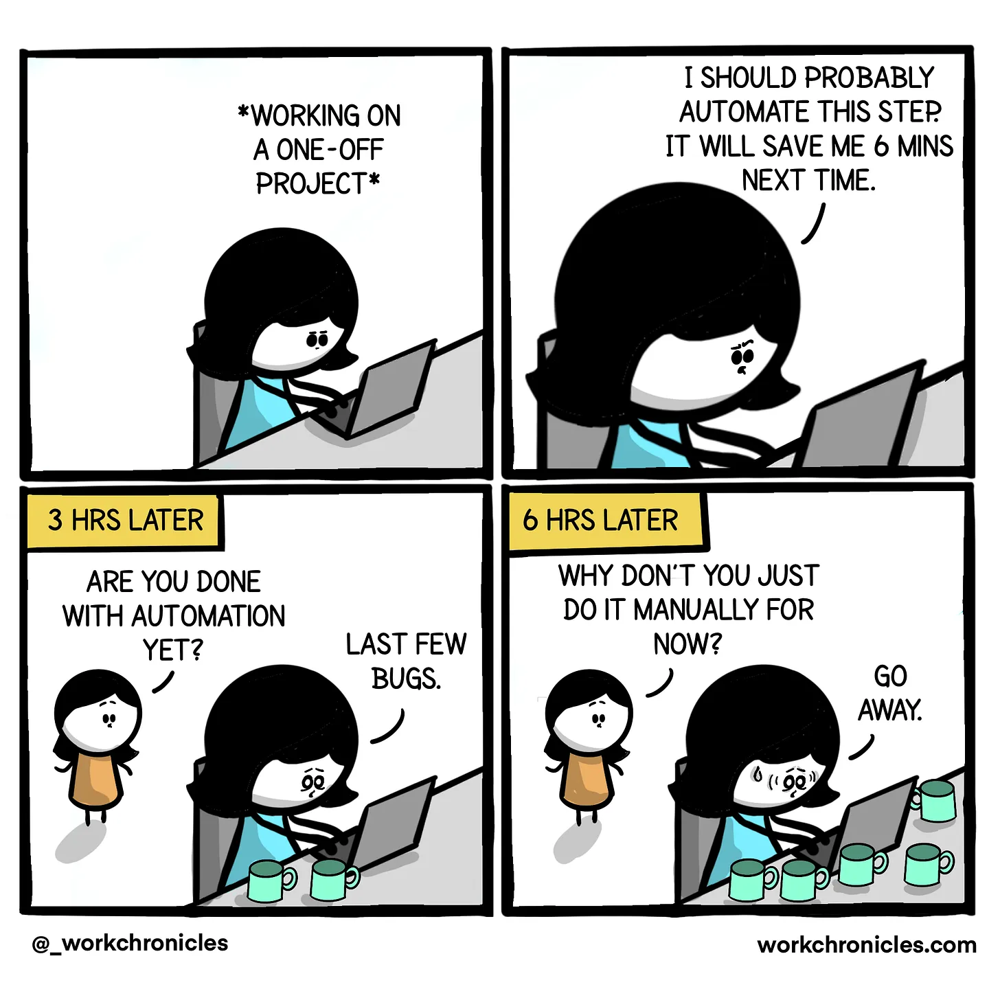
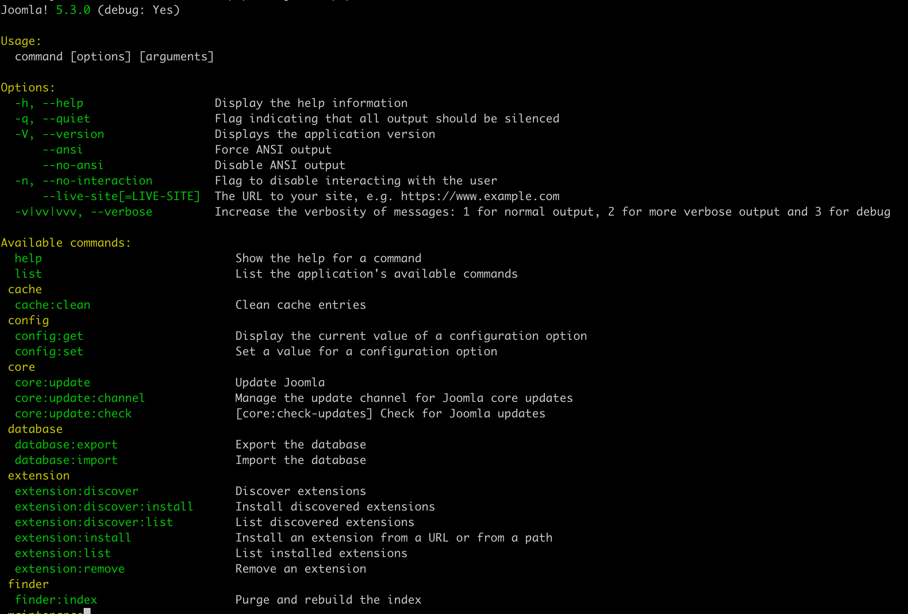

<!--
_class: cover
-->


---

<!--
_header: "Why I'm here"
footer: '[Developing Extensions for Joomla! 5](https://developingextensionsforjoomla5.com/jdayusa2025)'
-->

<div class="columns">
<div class="column column__content">

- Author of _Developing Extensions for Joomla! 5_
- I love CLI!!
- Some projects I have made with CLI:
  - Create email queues
  - Check renewal subscriptions
  - Update 26000 products in a HikaShop site

</div>
<div class="column">


## Carlos Cámara

</div>
</div>

---

<!--
_header: "The Grand Tour of Today's Adventures"
footer: '[Developing Extensions for Joomla! 5](https://developingextensionsforjoomla5.com/jdayusa2025)'
-->

1. Why CLI?
1. Working with the console in Joomla!
1. Writing our first console plugin in Joomla!
1. Adding options to our command

You may download the most recent version of this presentation at:

<div class="url container text-center text-white width-90">
  <a href="https://developingextensionsforjoomla5.com/jdayusa2025/">https://developingextensionsforjoomla5.com/jdayusa2025/</a>
</div>

---

<!--
_header: "Why CLI?"
-->

<div class="container text-center">



<div class="url text-center text-white widht-90">
  Source: <a href="https://workchronicles.substack.com/p/comic-automation">https://workchronicles.substack.com/p/comic-automation</a>
</div>
</div>

<!--

1. CLI is a great way to automate CRON jobs
2. No timeout in CLI
3. We may have different PHP configuration settings
4. Geeky way of doing things

-->

---

<!--
_header: "A bit of Joomla! Console"
-->

<div class="columns">
<div class="column column__content">

<div class="terminal">
php cli/joomla.php --list
</div>

<!--
1. Login to ssh or your terminal
2. Go to the Joomla root folder
3. Run the command: `php cli/joomla.php`
4. You will see a list of commands available
-->
</div>
<div class="column column__reference">

### References


Chapter 9

</div>

</div>

<!--
- You need ssh or terminal access
- It's implemented with Symfony console
- All options and settings from symfony console are valid
-->

---

<!--
_header: "A bit of Joomla! Console"
-->

<div class="columns">
<div class="column column__content">

<div class="container">



</div>

</div>
<div class="column column__reference">

### References


Chapter 9

</div>

</div>
<!--
1. You will see a list of commands available
1. Commands are usually 2 keywords separated by a colon and they are grouped by the first keyword
-->

---

<!--
_header: "Some usage tips"
-->
<div class="columns">
  <div class="column column__content">

1. All the commands are run using the command:

  <div class="terminal container">
  php cli/joomla.php COMMAND
  </div>

2. You can run the command with the option `--help` to see the available options

3. Common practice is to include the name of the related component to the command name

  </div>
  <div class="column column__reference">

### References


Chapter 9

  </div>
</div>

<!--
1. You need ssh or terminal access
1.  It's implemented with Symfony console
1. All options and settings from symfony console are valid
-->

---

<!--
_header: "Adding CLI commands to Joomla!"
-->

1. Core Commands are hard-coded into Joomla!
2. To add more commands we can develop a `console` plugin

---

<!--
_header: "All plugins are created equal"
-->

<div class="columns">
  <div class="column column__content">

1. Console plugins have the same structure as other plugins.
2. Console plugins are located in the folder `plugins/console`.
3. For output, we need to be aware we are not dealing with HTML anymore.

  </div>
  <div class="column column__reference">

### References


Chapter 9

  </div>
</div>

---

<!--
_header: "Last year Workshop"
-->

<div class="columns">
  <div class="column column__content">

1. Clear To-Do list component
1. We are going to create a plugin to check the deadlines for our tasks

  </div>
  <div class="column column__reference">

### References


[2024 workshop](https://www.jdayusa.com/sessions/unlock-the-power-of-joomla-5-develop-your-first-component-with-web-services-contd)

  </div>
</div>

---

<!--
_header: "Let's start writing our plugin"
-->
<div class="columns">
<div class="column column__content">

In your Joomla! installation, create our folder structure:

Create the folder structure:

1. `plugins/console`
1. `plugins/console/services`
1. `plugins/console/src`
1. `plugins/console/src/Extension`
1. `plugins/console/src/CliCommand`

</div>
<div class="column column__reference">

### References


Chapter 9

</div>
</div>

---

<!--
_header: "plugins/console/ctl/ctl.xml"
-->

<div class="columns">
<div class="column column__content">

```xml
<extension type="plugin" folder="console" method="upgrade">
...
    <namespace path="src">AwCo\Plugin\Console\ClearTodoList</namespace>
    <files>
        <folder plugin="ctl">services</folder>
        <folder>src</folder>
    </files>
</extension>
```

<div class="url text-white container">
  <a href="https://developingextensionsforjoomla5.com/jdayusa2025/live/basic-plugin">https://developingextensionsforjoomla5.com/<br/>
  jdayusa2025/live/basic-plugin</a>
</div>

</div>
<div class="column column__reference">

### References


Chapters 8 and 9

</div>
</div>

<!--
-->

---

<!--
_header: "src/CliCommands/TaskDeadlineCommand.php"
-->

<div class="columns">
<div class="column column__content">

```php
<?php
namespace AwCo\Plugin\Console\Task\CliCommand;

class TaskDeadlineCommand extends AbstractCommand
{
  protected static $defaultName = 'ctl:deadline';

  protected function configure(): void
  {
    $this->setDescription('Check the deadlines for your tasks.');
    $this->setHelp('Execute ctl:deadline to check the deadlines for your tasks.');
  }

  protected function doExecute(InputInterface $input, OutputInterface $output): int{}

}

```

<div class="url text-white container">
  <a href="https://developingextensionsforjoomla5.com/jdayusa2025/live/basic-plugin">https://developingextensionsforjoomla5.com/<br/>
  jdayusa2025/live/basic-plugin</a>
</div>

</div>
<div class="column column__reference">

### References


Chapters 8 and 9

</div>
</div>

<!--
-->

---

<!--
_header: "src/Extension/TaskConsolePlugin.php"
-->

<div class="columns">
<div class="column column__content">

```php
<?php

namespace AwCo\Plugin\Console\Task\Extension;

use AwCo\Plugin\Console\Task\CliCommand\TaskDeadlineCommand;

class TaskConsolePlugin extends CMSPlugin implements SubscriberInterface
{
    protected $autoloadLanguage = true;

    public static function getSubscribedEvents(): array
    {
        return [
                ApplicationEvents::BEFORE_EXECUTE => 'registerCLICommands'
        ];
    }

    public function registerCLICommands(ApplicationEvent $event): void
    {
        $app = $event->getApplication();

        $app->addCommand(new TaskDeadlineCommand());
    }
}

```

<div class="url text-white container">
  <a href="https://developingextensionsforjoomla5.com/jdayusa2025/live/basic-plugin">https://developingextensionsforjoomla5.com/<br/>
  jdayusa2025/live/basic-plugin</a>
</div>

</div>
<div class="column column__reference">

### References


Chapters 8 and 9

</div>
</div>

<!--
-->

---

<!--
_header: "services/provider.php"
-->

<div class="columns">
<div class="column column__content">

```php
<?php

...
use AwCo\Plugin\Console\Task\Extension\TaskConsolePlugin;

return new class implements ServiceProviderInterface
{
    public function register(Container $container)
    {
        $container->set(
            PluginInterface::class,
            function (Container $container) {
                $dispatcher = $container->get(DispatcherInterface::class);
                $plugin = new TaskConsolePlugin( $dispatcher,
                    (array) PluginHelper::getPlugin('console', 'task')
                );

                return $plugin;
            }
        );
    }
};
```

<div class="url text-white container">
  <a href="https://developingextensionsforjoomla5.com/jdayusa2025/live/basic-plugin">https://developingextensionsforjoomla5.com/<br/>
  jdayusa2025/live/basic-plugin</a>
</div>

</div>
<div class="column column__reference">

### References


Chapters 8 and 9

</div>
</div>

<!--
-->

---

<!--
_header: "First install"
-->

<div class="columns">
<div class="column column__content">

1. We use the nice _Discover_ function at Joomla! Backend
1. We enable the plugin in our backend
1. After that, we can run the command:

<div class="terminal">

php cli/joomla.php ctl:deadline

</div>

</div>
<div class="column column__reference">

### References


Chapter 9

</div>
</div>

<!--
-->

---

<!--
_header: "Adding functionality to our plugin"
-->

<div class="columns">
<div class="column column__content">

File: `src/CliCommand/TaskDeadlineCommand.php`

```php
    class SpmTaskDeadlineCommand extends AbstractCommand
    {
      ...

      protected function doExecute(InputInterface $input, OutputInterface $output):  int
      {
          $outputStyle = new SymfonyStyle($input, $output);
          $outputStyle->title('Upcoming deadlines for your tasks');

          $deadlines = $this->getDeadlines();

          $this->showDeadlines($outputStyle, $deadlines);

          return Command::SUCCESS;
      }

    }
```

</div>
<div class="column column__reference">

### References


Chapter 9

</div>
</div>

<!--
-->

---

<!--
_header: "Adding functionality to our plugin"
-->

<div class="columns">
<div class="column column__content">

File: `src/CliCommand/TaskDeadlineCommand.php`

```php
      protected function getDeadlines(): array
      {
        $days = 42;

        $db = Factory::getContainer()->get(DatabaseInterface::class);
        $query = $db->createQuery();
        $query->select('*')
            ->from('#__spm_tasks');

        $query->where('deadline BETWEEN NOW() AND DATE_ADD(NOW(), INTERVAL ' . $days . ' DAY)');
        $db->setQuery($query);
        $deadlines = $db->loadAssocList('id');

        return $deadlines;
      }

      protected function showDeadlines($outputStyle, $deadlines)
      {
          if (empty($deadlines)) {
              $outputStyle->note('There are no upcoming deadlines for your tasks.');
          } else {
            $outputStyle->table(['Id', 'Task', 'Status', 'Description', 'Deadline', 'Created by'], $deadlines);
          }
      }
```

</div>
<div class="column column__reference">

### References


Chapter 9

</div>
</div>

<!--
-->

---

<!--
_header: "Adding options to our command"
-->
<div class="columns">
<div class="column column__content">

File: `src/CliCommand/TaskDeadlineCommand.php`

```php
    class SpmTaskDeadlineCommand extends AbstractCommand
    {
      protected function configure(): void
      {
          ...

          $this->addOptions();
      }

      protected function addOptions()
      {
          $description = 'Days in the future to check for deadlines.';
          $this->addOption('days', 'd', InputOption::VALUE_OPTIONAL, $description, 7);

          return;
      }
    }
```

</div>
<div class="column column__reference">

### References


Chapter 9

</div>
</div>

---

<!--
_header: "Passing the options to our command"
-->

<div class="columns">
<div class="column column__content">

```php
  ...
    class SpmTaskDeadlineCommand extends AbstractCommand
    {
      ...

      protected function doExecute(InputInterface $input, OutputInterface $output):  int
      {
          $outputStyle = new SymfonyStyle($input, $output);
          $outputStyle->title('Upcoming deadlines for your tasks');

          $options = $this->getOptions($input);

          $deadlines = $this->getDeadlines($options);

          $this->showDeadlines($outputStyle, $deadlines);

          return Command::SUCCESS;
      }

      protected function getOptions($input): array
      {
          $options = [];

          $options = $input->getOptions();

          return $options;
      }
```

</div>
<div class="column column__reference">

### References


Chapter 9

</div>
</div>

---

<!--
_header: "Passing the options to our command"
-->

<div class="columns">
<div class="column column__content">

```php
  ...
    class SpmTaskDeadlineCommand extends AbstractCommand
    {
      ...

      protected function getDeadlines($options) : array
      {
          $deadlines = [];
          $days = (int)$options['days'];
          if ($days <= 0) {
              $days = 7;
          }
          $db = $this->getDatabase();
          $query = $db->getQuery(true);
          $query->select('id, project, title AS task')
              ->from('#__awco_tasks');
          $query->where('deadline BETWEEN NOW() AND DATE_ADD(NOW(), INTERVAL ' . $days . ' DAY)');
          $query->setQuery($query);
          $deadlines = $db->loadAssocList('id');
          return $deadlines;
      }
    }
```

</div>
<div class="column column__reference">

### References


Chapter 9

</div>
</div>

---

<!--
_header: "Ideas for commands"
-->
<div class="columns">
<div class="column column__content">

### Basic checks for our plugin

- Domain expiration
- SSL expiration
- Disk Usage
- Article published this week

</div>
<div class="column column__reference">

### References


Chapter 1

</div>
</div>

---

<!--
_header: "On the shoulder of giants"
-->

- Joomla Extension Development by Nicholas Dionysopoulos
  - https://www.dionysopoulos.me/book.html
- Joomla 4 – Developing Extensions: Step by step to an working Joomla extension

  - https://a.co/d/1BIVa8j
  - https://web.archive.org/web/20230518080457/https://blog.astrid-guenther.de/en/der-weg-zu-joomla4-erweiterungen/

- Joomla! Documentation

  - https://manual.joomla.org

  <!-- I have not seen furhther but I definitely was on the shoulders of giants.-->

---

<!--
_class: thank-you
footer: ''
-->

<div class="text-huge">
    Thank you!
</div>

<div>

Get all the code and more articles about Joomla! extension development at:
<a href="https://developingextensionsforjoomla5.com">DevelopingExtensionsForJoomla5.com</a>

</div>
